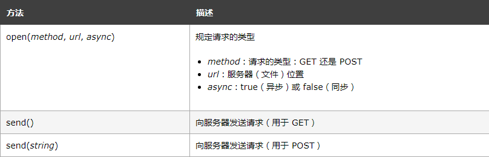

# JS AJAX

## AJAX 简介

AJAX 是开发者的梦想，因为您能够：

 - 不刷新页面更新网页
 - 在页面加载后从服务器请求数据
 - 在页面加载后从服务器接收数据
 - 在后台向服务器发送数据

AJAX:

 - AJAX 并不是编程语言。
 - AJAX 是一种从网页访问 Web 服务器的技术。
 - AJAX 代表异步 JavaScript 和 XML。

### 什么是 AJAX？

AJAX = Asynchronous JavaScript And XML.

AJAX 并非编程语言。

AJAX 仅仅组合了：

 - 浏览器内建的 XMLHttpRequest 对象（从 web 服务器请求数据）
 - JavaScript 和 HTML DOM（显示或使用数据）

Ajax 是一个令人误导的名称。Ajax 应用程序可能使用 XML 来传输数据，但将数据作为纯文本或 JSON 文本传输也同样常见。

Ajax 允许通过与场景后面的 Web 服务器交换数据来异步更新网页。这意味着可以更新网页的部分，而不需要重新加载整个页面。

### AJAX 如何工作


 1. 网页中发生一个事件（页面加载、按钮点击）
 2. 由 JavaScript 创建 XMLHttpRequest 对象
 3. XMLHttpRequest 对象向 web 服务器发送请求
 4. 服务器处理该请求
 5. 服务器将响应发送回网页
 6. 由 JavaScript 读取响应
 7. 由 JavaScript 执行正确的动作（比如更新页面）

## AJAX - XMLHttpRequest 对象

> Ajax 的核心是 XMLHttpRequest 对象。

### XMLHttpRequest 对象

所有现代浏览器都支持 XMLHttpRequest 对象。

XMLHttpRequest 对象用于同幕后服务器交换数据。这意味着可以更新网页的部分，而不需要重新加载整个页面。

### 创建 XMLHttpRequest 对象

所有现代浏览器（Chrom、IE7+、Firefox、Safari 以及 Opera）都有内建的 XMLHttpRequest 对象。

创建 XMLHttpRequest 的语法是：

``` javascript
variable = new XMLHttpRequest();
```

老版本的 Internet Explorer（IE5 和 IE6）使用 ActiveX 对象：

``` javascript
variable = new ActiveXObject("Microsoft.XMLHTTP");
```

为了应对所有浏览器，包括 IE5 和 IE6，请检查浏览器是否支持 XMLHttpRequest 对象。如果支持，创建 XMLHttpRequest 对象，如果不支持，则创建 ActiveX 对象：

``` javascript
var xhttp;
if (window.XMLHttpRequest) {
    xhttp = new XMLHttpRequest();
    } else {
    // code for IE6, IE5
     xhttp = new ActiveXObject("Microsoft.XMLHTTP");
}
```

### 跨域访问

出于安全原因，现代浏览器不允许跨域访问。

这意味着尝试加载的网页和 XML 文件都必须位于相同服务器上。

W3School 上的实例都会打开位于 W3School 域上的 XML 文件。

如果您希望在自己的页面上使用以上实例，那么您所加载的 XML 文件必须位于您自己的服务器上。

### XMLHttpRequest 对象方法


### XMLHttpRequest 对象属性


## AJAX - 向服务器发送请求

> XMLHttpRequest 对象用于同服务器交换数据。

### 向服务器发送请求

如需向服务器发送请求，我们使用 XMLHttpRequest 对象的 open() 和 send() 方法：

``` javascript
xhttp.open("GET", "ajax_info.txt", true);
xhttp.send();
```



### GET 还是 POST？

GET 比 POST 更简单更快，可用于大多数情况下。

不过，请在以下情况始终使用 POST：

 - 缓存文件（更新服务器上的文件或数据库）
 - 向服务器发送大量数据（POST 无大小限制）
 - 发送用户输入（可包含未知字符），POST 比 GET 更强大更安全

### GET 请求

一条简单的 GET 请求：

``` javascript
xhttp.open("GET", "demo_get.asp", true);
xhttp.send();
```

在上面的例子中，您可能会获得一个缓存的结果。为了避免此情况，请向 URL 添加一个唯一的 ID：

``` javascript
xhttp.open("GET", "demo_get.asp?t=" + Math.random(), true);
xhttp.send();
```

如果您需要用 GET 方法来发送信息，请向 URL 添加这些信息：

``` javascript
xhttp.open("GET", "demo_get2.asp?fname=Bill&lname=Gates", true);
xhttp.send();
```

### POST 请求

一条简单的 POST 请求：

``` javascript
xhttp.open("POST", "demo_post.asp", true);
xhttp.send();
```

如需像 HTML 表单那样 POST 数据，请通过 setRequestHeader() 添加一个 HTTP 头部。请在 send() 方法中规定您需要发送的数据：

``` javascript
xhttp.open("POST", "ajax_test.asp", true);
xhttp.setRequestHeader("Content-type", "application/x-www-form-urlencoded");
xhttp.send("fname=Bill&lname=Gates");
```


### url - 服务器上的文件

open() 方法的 url 参数，是服务器上文件的地址：

``` javascript
xhttp.open("GET", "ajax_test.asp", true);
```

该文件可以是任何类型的文件，如 .txt 和 .xml，或服务器脚本文件，如 .asp 和 .php（它们可以在发送回响应之前在服务器执行操作）。


### 异步 - ture 还是 false？

如需异步发送请求，open() 方法的 async 参数必须设置为 true：

``` javascript
xhttp.open("GET", "ajax_test.asp", true);
```

发送异步请求对 web 开发人员来说是一个巨大的进步。服务器上执行的许多任务都非常耗时。在 AJAX 之前，此操作可能会导致应用程序挂起或停止。

通过异步发送，JavaScript 不必等待服务器响应，而是可以：

 - 在等待服务器响应时执行其他脚本
 - 当响应就绪时处理响应

### onreadystatechange 属性

通过 XMLHttpRequest 对象，您可以定义当请求接收到应答时所执行的函数。

这个函数是在 XMLHttpResponse 对象的 onreadystatechange 属性中定义的：

``` javascript
xhttp.onreadystatechange = function() {
  if (this.readyState == 4 && this.status == 200) {
    document.getElementById("demo").innerHTML = this.responseText;
  }
};
xhttp.open("GET", "ajax_info.txt", true);
xhttp.send();
```